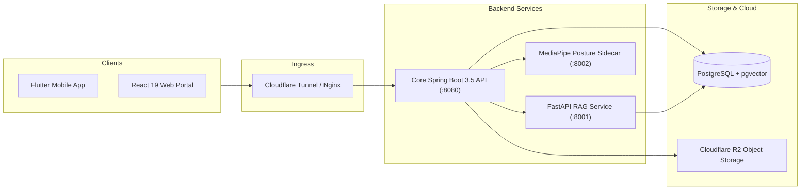

# 👨‍💻 Nguyen Danh Huy (Huy Nguyen)

  

  <strong>📍 Hanoi, Vietnam</strong> • 
  <strong>🎓 FPT University (B.S. Software Engineering)</strong> • 
  <strong>✉️ <a href="mailto:huy412004@gmail.com">huy412004@gmail.com</a></strong>

  
  
  
  

---

## 🎯 Engineering Profile & Focus

- **Core Competencies**: Versatile **Software Engineer** with production-grade engineering experience across **Java Spring Boot Backend & Modular Monoliths**, **AI RAG Pipelines (Google Gemini + pgvector)**, **Flutter Mobile Development**, and **Modern React Web Apps**.
- **Engineering Mindset**: Dedicated to clean code, strict architectural boundaries, automated CI/CD pipelines, and high-reliability software delivering real user impact.

---

## 🛠️ Technical Arsenal

### Languages & Frameworks

### Database, Cloud & AI Systems

---

## 🚀 Flagship Projects

### 🏥 1. [CareBridge — Maternal & Early Childhood Healthcare Platform (MECHP)](https://github.com/huynd4104/Care-Bridge)
> **Role:** Fullstack & AI Integration Developer | **Timeline:** 05/2026 – 09/2026  
> **Architecture:** Modular Monolith + Python AI RAG Microservices + Cross-Platform Clients

CareBridge is an enterprise-grade digital healthcare continuum built in compliance with **WHO and Vietnam Ministry of Health (MOH)** clinical standards, featuring **88 production use cases across 9 domains**.

#### Key Technical Contributions:
- **Clinical AI Assistant (RAG Engine):** Integrated Google Gemini API with hybrid n-gram lexical and `pgvector` similarity search over MOH guidelines to deliver maternal symptom triage with medical disclaimers and GPS emergency alerts.
- **Emergency SOS & Healthcare Facility Locator:** Integrated TrackAsia Maps API and GPS spatial queries to locate accredited maternal/pediatric facilities with turn-by-turn navigation and 1-tap SOS family broadcast.
- **Community Forum & AI Content Moderation:** Developed peer & verified-expert Q&A forum with stage-based filtering; integrated AI moderation pipelines using semantic NLP analysis to detect and filter toxic content and medical misinformation.
- **Real-Time Safety & IMU Fall Detection:** Built mobile sensor processing in Flutter using accelerometer and gyroscope vectors with calibrated threshold filters and automated 30s family broadcast countdowns.
- **WebRTC Medical Teleconsultations:** Orchestrated 1-on-1 encrypted audio/video teleconsultations with automatic session recording and background upload lifecycles to Cloudflare R2 / Cloudinary.
- **Enterprise Security & Data Isolation:** Designed RS256 asymmetric JWT authentication with SPKI public key ring rotation and Flyway database migration versioning.

---

### 🧩 2. [HeyKid — Language Intervention Platform for Children](https://github.com/huynd4104/project-ha)
> **Role:** Fullstack Developer | **Timeline:** 05/2026 – 06/2026  
> **Tech:** Java 17, Spring Boot 3.5, Flutter (Dart), React (TypeScript), PostgreSQL (Supabase), Cloudflare R2, Docker

Cross-platform intervention application supporting speech and cognitive therapy for children with developmental delays.

#### Key Technical Contributions:
- **3-Module Monolith Monorepo:** Structured domain services with Spring Boot REST APIs, JWT access/refresh token rotation, and strict RBAC authorization.
- **Interactive Speech AI Practice:** Empathic mascot dialogue flow using on-device STT/TTS for ultra-low latency, child-safe speech practice sessions.
- **Admin Dynamic Curriculum Builder:** Comprehensive portal for managing Programs → Learning Paths → Lessons → Activities (Flashcards, Speech drills).
- **Gamified Engagement & NFC Cards:** Child learning map with XP, streaks, badges, and quick contactless authentication via NFC cards or QR codes.
- **Zero-Bandwidth Cloud Media Pipeline:** Presigned S3 URLs directly to Cloudflare R2, containerized with Docker, deployed via GitHub Actions to Render & Vercel.

---

## 💼 Experience & Education

| Period | Organization / School | Role / Degree | Key Highlights |
| :--- | :--- | :--- | :--- |
| **05/2025 – 08/2025** | **FPT Software Academy** | Java Backend / Software Engineering Intern | Enterprise Spring Boot, REST APIs, JPA/Hibernate, Relational DB Design, Git Flow |
| **2022 – 2026** | **FPT University, Hanoi** | Bachelor of Science in Software Engineering | Specialized in Enterprise Systems, AI Architecture & Distributed Software |

> **Academic Supervisor Reference:**  
> **Assoc. Prof. Dr. Nguyễn Cường Mạnh (PGS. TS. Nguyễn Cường Mạnh)**  
> Lecturer & Graduation Project Supervisor, FPT University Hanoi  
> ✉️ Email: `ManhNC5@fe.edu.vn` | 📞 Phone: `0966 896 568`

---

## 📊 GitHub Stats

  
  

---

  <i>"Committed to clean architecture, reliable distributed data pipelines, and production-grade AI infrastructure."</i> 
  <strong>Feel free to reach out for software engineering and AI infrastructure opportunities!</strong>

